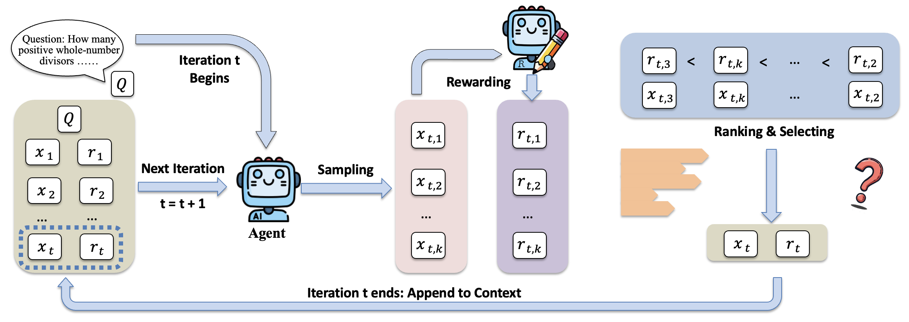
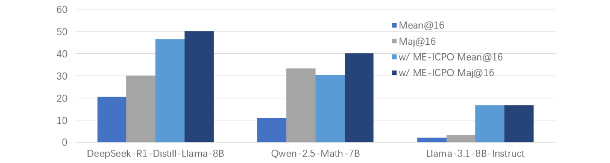

<div align="center">

# ME-ICPO: Minimum-Entropy In-Context Policy Optimization

[](https://openreview.net/pdf?id=TAthdtPe7k)
[](https://github.com/yangyuxiao-sjtu/ICRL)

</div>

<div align="center" style="font-family: Arial, sans-serif;">
  <p>
    <a href="#news"><b>🎉 News</b></a> •
    <a href="#introduction"><b>📖 Introduction</b></a> •
    <a href="#main-results"><b>📊 Main Results</b></a>
  </p>
  <p>
    <a href="#getting-started"><b>✨ Getting Started</b></a> •
    <a href="#configuration"><b>⚙️ Configuration</b></a> •
    <a href="#contact"><b>📨 Contact</b></a> •
    <a href="#citation"><b>🎈 Citation</b></a>
  </p>
</div>

> In-context learning can implement policy optimization — ME-ICPO is one such instantiation.

---

## 🎉 News
- **[2026]** ICPO are accepted to **ICLR 2026**.
- **[2025]** Initial release of the ME-ICPO reference implementation.
- **[2025]** Baselines and ablation settings added.

---

## 📖 Introduction

**In-Context Policy Optimization (ICPO)** is a general framework proposed in our paper for understanding and designing **test-time scaling algorithms** for large language model reasoning.

ICPO views multi-round reasoning as a **response-level policy optimization process**, where each round:
- samples candidate solutions,
- receives self-assessed rewards,
- and updates the policy implicitly through in-context roll-ins.

---

### ME-ICPO

**Minimum-Entropy ICPO (ME-ICPO)** is a concrete algorithm instantiated under the ICPO framework.

It selects candidate responses that, when rolled into the context, **minimize the predictive entropy of future generations**, thereby stabilizing subsequent reasoning rounds under noisy self-reward signals.

> **This repository contains a reference implementation of ME-ICPO**.

<p align="center">
  
</p>

---

## 📊 Main Results

ME-ICPO consistently improves reasoning performance across math and logic benchmarks.

Key observations:
- ME-ICPO significantly outperforms majority voting and reward-only selection.
- Entropy-based selection is critical for stability under noisy self-reward.
- Performance improves monotonically with increased sampling budget and reasoning rounds.

<p align="center">
  
</p>

---


## ✨Getting Started

### Env Setup


### ....
---

## 📨Contact

- Tianrun Yu: 
- Yuxiao Yang: 
---
## 🎈Citation
If you find TTRL helpful, please cite us.

```bibtex
@article{
}
```
---
## 🌟 Star History

[](https://www.star-history.com/#yangyuxiao-sjtu/ICRL&Date)

